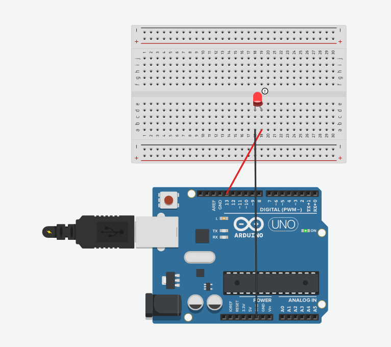
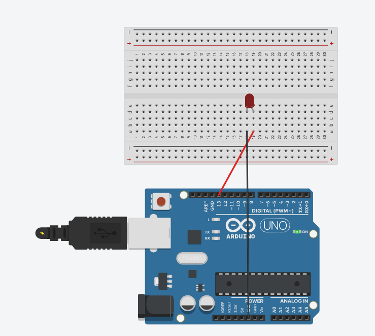

# Practica-01 Arduino LED

### Componentes necesarios:
* Placa Arduino x1
* BreadBoard x1
* Cable x2
* LED x1
### Explicación:
Conectamos el la __placa arduino__ a la __BreadBoard__. Para esto cojemos el __cable__ rojo y lo sacamos desde la ranura 13 al numero 19 que esta en la pata larga del __LED__. Seguido a esto cojemos el __cable__ negro(polaridad negativa) y lo sacamos desde GND al numero 18.

### Código necesario: 

``` C
void setup()
{
  pinMode(13, OUTPUT);
}

void loop()
{
  digitalWrite(13, HIGH);
  delay(3000); 
  digitalWrite(13, LOW);
  delay(1000); 
  }
```

#### Explicacion del código:
Este código esta programado para que el LED se mantenga encendido durante 3" segundos y se apague durante 1".

## Imagenes:




