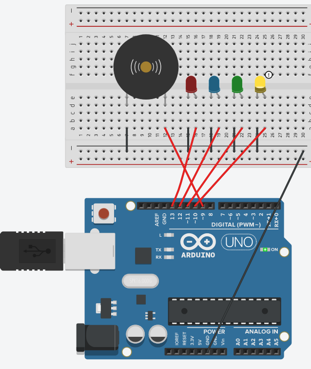

# Practica-03 Arduino LED / Altavoz

### Componentes necesarios:
* Placa Arduino x1
* BreadBoard x1
* Cable x11
* LED x4
* Buzzer x1

### Explicación:
Conectar la __placa arduino__ a la __BreadBoard__. Conectar los correspondientes __cables__ y el __Buzzer__ (altavoz).

### Código necesario:

```c
void setup()
{
  const int pinBuzzer = 9;
  for ( int i = 10 ; i <= 13 ; i++)
  {
    pinMode(i, OUTPUT);
  }

}

void loop()
{
   for (int i=10 ; i <= 13 ; i++)
  {
       digitalWrite( i , HIGH) ;
       delay (500) ;
       tone(9, 440);
       delay(500);
       digitalWrite( i , LOW);
       noTone(9);
       delay(500);
       delay (500) ;
  }
}
```

### Explicación de código
Esto código hará que cada vez que se encienda una luz, el altavoz haga un sonido.

### Imagen:
