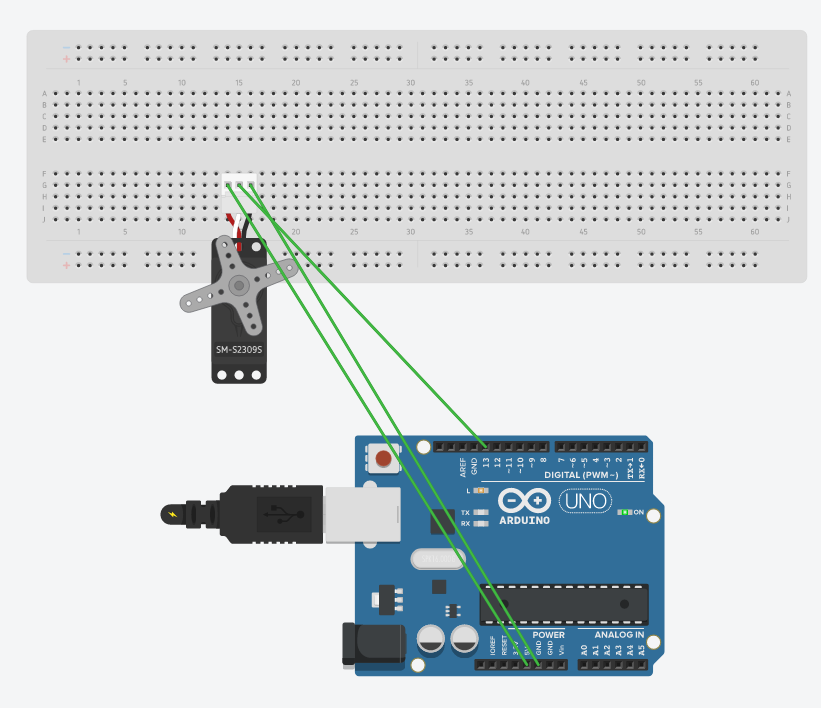

# Practica-04 Arduino LED

### Componentes necesarios:
* Placa Arduino x1
* BreadBoard x1
* Cable x3
* ServoMotor x1
### Explicación:
Conectamos los cables de la manera adecuada como indican los colores de la imagen en el __servomotor__ y a continuacion introducimos el siguinte código. Este código movera el __servomotor__.
### Código necesario: 
```c

#include <Servo.h>         // Incluir la librería Servo
Servo servo1;             // Crear un objeto tipo Servo llamado servo1
int angulo = 0 ;
int pin=13;
void setup()
{
        servo1.attach(pin) ;         // Conectar servo1 al pin 13
}

void loop()
{
        for(angulo  = 0; angulo  <= 180; angulo  += 1)   //incrementa angulo 1 grado
            {
                 servo1.write(angulo);
                 delay(25);
            }
        for(angulo  = 180; angulo  >=0; angulo  -=1 )    //decrementa angulo 1 grado
            {
                 servo1.write( angulo );
                 delay(25);
            }
}
```

### Explicación de código
Este código hará que el __servomotor__ gire.

### Imagen:

